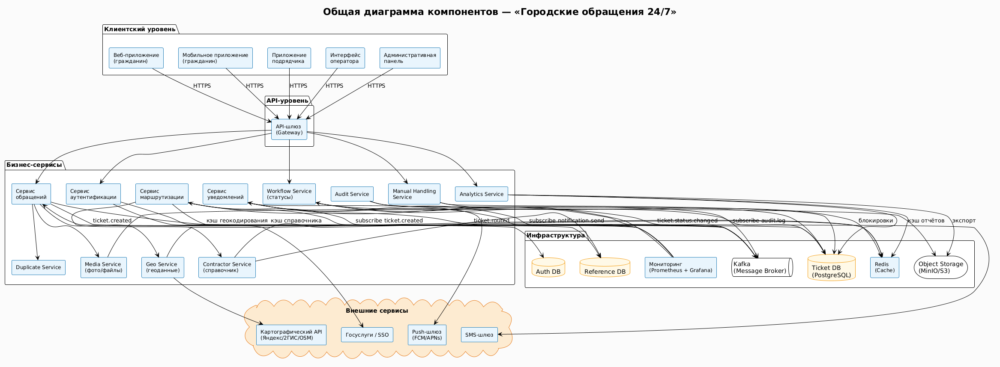
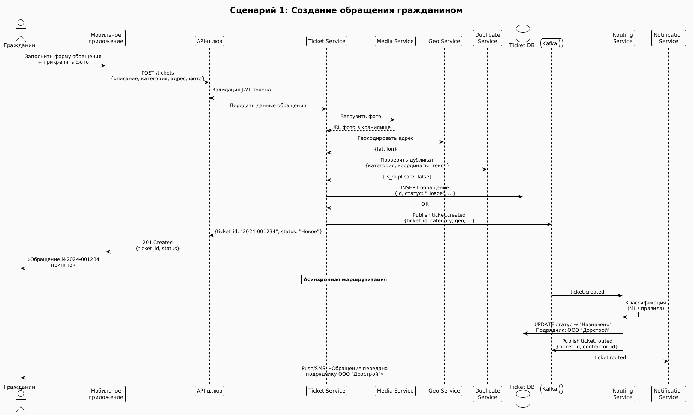
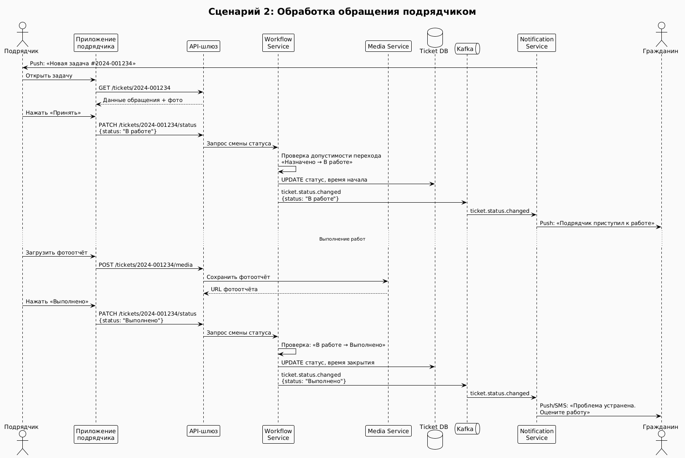
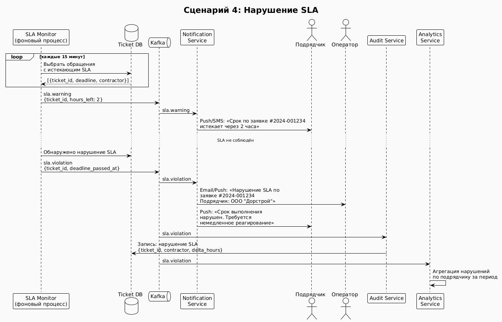

# Архитектура системы «Городские обращения 24/7»

---

## Содержание

1. [Общая диаграмма компонентов](#Общая-диаграмма-компонентов)
2. [Декомпозиция на компоненты и обязанности](#Декомпозиция-на-компоненты-и-обязанности)
3. [Сценарии взаимодействия](#Сценарии-взаимодействия)
4. [Ключевые архитектурные решения (ADR)](#Ключевые-архитектурные-решения-adr)

---

## Общая диаграмма компонентов



Система построена по принципу **микросервисной архитектуры** с единым API-шлюзом в качестве точки входа для всех клиентских приложений. Внутренние сервисы взаимодействуют через брокер сообщений (Kafka) для асинхронных операций и напрямую через REST/gRPC для синхронных вызовов. Хранение данных разделено: реляционная БД для обращений, объектное хранилище для медиафайлов, Redis для кэша и сессий.

```
┌─────────────────────────────────────────────────────────────────────┐
│                         КЛИЕНТСКИЙ УРОВЕНЬ                          │
│  Веб-приложение   Мобильное приложение   Приложение подрядчика      │
│  (гражданин)      (гражданин)            Интерфейс оператора        │
│                                          Административная панель    │
└──────────────────────────┬──────────────────────────────────────────┘
                           │ HTTPS / WebSocket
┌──────────────────────────▼──────────────────────────────────────────┐
│                         API-ШЛЮЗ (Gateway)                          │
│            Аутентификация · Авторизация · Rate Limiting             │
└──────┬──────────────┬────────────┬───────────────┬──────────────────┘
       │              │            │               │
 ┌─────▼────┐  ┌──────▼────┐ ┌───▼──────┐  ┌─────▼──────┐
 │ Сервис   │  │ Сервис    │ │ Сервис   │  │ Сервис     │
 │обращений │  │маршрутиз. │ │статусов  │  │уведомлений │
 └─────┬────┘  └──────┬────┘ └───┬──────┘  └────────────┘
       │              │          │
       └──────────────┴──────────┘
                      │
            ┌─────────▼──────────┐
            │   Message Broker   │
            │       (Kafka)      │
            └────────────────────┘
```

---

## Декомпозиция на компоненты и обязанности

### 4.1 Перечень компонентов

---

### Клиентские приложения

#### Веб-приложение (гражданин)

Интерфейс для создания обращений, просмотра статуса, истории, загрузки фотографий. Отправка запросов к API-шлюзу. Отображение карты с привязкой к геолокации. Получение уведомлений через WebSocket / push-уведомления.

#### Мобильное приложение (гражданин)

Нативное приложение с теми же функциями, что и веб. Офлайн-сохранение черновиков обращений. Определение GPS-координат. Уведомления через push-шлюз.

#### Приложение подрядчика

Интерфейс для просмотра назначенных задач, изменения статусов («Принято», «В работе», «Выполнено»), загрузки фотоотчётов и комментариев. Локальное кэширование задач и офлайн-режим с очередью синхронизации.

#### Интерфейс оператора

Рабочее место оператора с таблицей обращений, фильтрацией, поиском. Карточка обращения для редактирования, ручной маршрутизации, объединения дубликатов, отклонения. Просмотр истории изменений и журнала аудита.

#### Административная панель

Управление пользователями и ролями. Конфигурация правил маршрутизации, категорий проблем, зон ответственности подрядчиков. Параметры уведомлений. Просмотр системных логов и метрик мониторинга.

#### Аналитический модуль

Построение дашбордов и отчётов (количество обращений, динамика, карта проблем, эффективность подрядчиков). Экспорт данных в CSV/Excel/PDF. Асинхронная генерация тяжёлых отчётов с отправкой ссылки пользователю.

---

### Серверные сервисы

#### API-шлюз (Gateway)

Единая точка входа для всех клиентов (веб, мобильные, подрядчик, оператор). Аутентификация и авторизация запросов (JWT-токен). Лимитирование запросов (rate limiting). Маршрутизация запросов к внутренним микросервисам.

#### Сервис аутентификации и управления пользователями

Интеграция с внешним SSO / корпоративным AD (при необходимости). Регистрация и авторизация граждан (через Госуслуги, email, телефон). Выдача и валидация JWT-токенов. Управление профилями пользователей. Хранение учётных данных в отдельной БД.

#### Сервис обращений (Ticket Service)

Приём и сохранение новых обращений. Присвоение уникального ID, начального статуса «Новое». Валидация полей, антиспам-проверка, проверка дубликатов (через вызов Duplicate Service). Запись в Ticket DB. Генерация события `ticket.created` в брокер сообщений.

#### Сервис маршрутизации (Routing Service)

Автоматическая классификация обращения (текст, категория, фото, геолокация) через ML-модуль или правила. Выбор подрядчика по типу проблемы, району, зоне ответственности, приоритету и текущей загрузке. Перевод обращения в статус «Назначено подрядчику». Отправка события `ticket.routed` в брокер. Fallback — очередь оператора при невозможности автоматической классификации.

#### Сервис исполнителей (Contractor Service)

Справочник подрядных организаций, их зон ответственности (геозоны, типы проблем), контактов, приоритетов. Кэширование данных для быстрого выбора маршрутизатором. API для администратора (CRUD подрядчиков).

#### Сервис статусов и жизненного цикла (Workflow Service)

Управление переходами статусов обращения согласно конечному автомату:

```
Новое → Назначено → В работе → Выполнено
                             → Отклонено
                             → Закрыто
```

Контроль допустимых переходов для каждой роли. Фиксация времени каждого статуса. Генерация событий `ticket.status.changed` для уведомлений и аудита.

#### Сервис уведомлений (Notification Service)

Отправка уведомлений гражданам (push, SMS, email) и подрядчикам (push, email) о смене статуса, новой задаче, приближении/нарушении SLA. Асинхронная обработка очереди уведомлений. Повторные попытки при недоступности внешних шлюзов. Логирование доставки.

#### Сервис фото и файлов (Media Service)

Загрузка, хранение и раздача фотографий от граждан и подрядчиков. Ресайз, конвертация форматов, проверка на вредоносный код. Интеграция с объектным хранилищем (S3/MinIO). Вычисление контрольных сумм (MD5/SHA256). Поддержка отложенной загрузки при недоступности хранилища.

#### Сервис геоданных (Geo Service)

Абстракция над картографическим API (Яндекс.Карты, 2ГИС, OpenStreetMap). Автоматическое определение координат по адресу (геокодирование). Обратное геокодирование. Кэширование результатов для повторяющихся адресов. Fallback-режим с ручным вводом координат.

#### Сервис дубликатов (Duplicate Service)

Проверка новых обращений на дубликаты по геолокации (близость координат), категории, тексту (схожесть через расстояние Левенштейна или эмбеддинги). Хранение индекса открытых обращений за последние 30 дней. Возвращает вероятность дубликата и ссылку на существующее обращение.

#### Сервис аудита и логирования (Audit Service)

Запись всех значимых событий (создание, редактирование, смена статуса, назначение, просмотр оператором). Криптографическая защита цепочки (хеш предыдущей записи). Неизменяемое хранение в отдельной схеме БД аудита. Предоставление API для выборки и экспорта актов аудита.

#### Сервис аналитики и отчётов (Analytics Service)

Агрегация данных из Ticket DB, Audit, Contractor Service для построения дашбордов. Предрасчёт витрин данных (по районам, категориям, подрядчикам, дням). Кэширование результатов. Асинхронная генерация отчётов с сохранением в объектное хранилище.

#### Сервис ручной обработки оператора (Manual Handling Service)

Управление очередью обращений, требующих ручной классификации или коррекции. Блокировка обращения на редактирование (пессимистическая блокировка). Предотвращение конфликтов одновременного редактирования. Возврат обращения на доработку гражданину.

---

### Инфраструктурные компоненты

#### Очередь сообщений / Брокер (Message Broker — Kafka)

Центральная шина событий. Топики:

| Топик                   | Описание                       |
| ----------------------- | ------------------------------ |
| `ticket.created`        | Новое обращение создано        |
| `ticket.routed`         | Обращение назначено подрядчику |
| `ticket.status.changed` | Изменение статуса обращения    |
| `notification.send`     | Запрос на отправку уведомления |
| `sla.violation`         | Нарушение SLA                  |
| `audit.log`             | Запись в журнал аудита         |

Обеспечивает асинхронность, надёжность доставки, повторные попытки. Развязывает микросервисы между собой.

#### База данных обращений (Ticket DB — PostgreSQL)

Реляционная БД для хранения обращений, статусов, назначений, истории изменений. Индексы для поиска и фильтрации. Шардирование по району/дате при росте объёмов. Репликация master-replica.

#### База данных справочников (Reference DB)

Хранение категорий проблем, подрядчиков, зон ответственности, SLA-правил, шаблонов уведомлений, настроек ролей. Отдельная БД для часто меняющихся конфигураций.

#### Объектное хранилище (Object Storage — MinIO / S3)

Хранение фотографий, отчётных файлов, экспортированных отчётов. Поддержка прямых upload-ов через подписанные URL. Резервное копирование в холодное хранилище.

#### Кэш (Redis)

Кэширование справочников (подрядчики, категории), сессий пользователей, результатов геокодирования, популярных отчётов. Хранение очередей для фоновых задач (отложенные уведомления, синхронизация).

#### Сервис мониторинга и алертов

Сбор метрик (Prometheus), логирование (ELK Stack), дашборды (Grafana). Алерты при падении SLA, недоступности внешних сервисов, задержках в очереди. Контроль health-статусов всех микросервисов.

---

## Сценарии взаимодействия

### Сценарий 1. Создание обращения гражданином



**Описание:** Гражданин через мобильное или веб-приложение создаёт обращение о проблеме в городской инфраструктуре (например, «яма на дороге»). Прикладывает фото, указывает адрес или использует GPS.

**Шаги:**

1. Клиент отправляет POST-запрос с данными обращения и фото на API-шлюз.
2. API-шлюз проверяет JWT-токен и перенаправляет запрос в Ticket Service.
3. Ticket Service передаёт фото в Media Service для загрузки в объектное хранилище.
4. Ticket Service вызывает Geo Service для геокодирования адреса (если введён текстом).
5. Ticket Service вызывает Duplicate Service — проверка на дубликат по координатам и категории.
6. При отсутствии дубликата — обращение сохраняется в Ticket DB со статусом «Новое», присваивается уникальный ID.
7. Ticket Service публикует событие `ticket.created` в Kafka.
8. Routing Service подписан на `ticket.created` — автоматически классифицирует и назначает подрядчика.
9. Notification Service подписан на `ticket.routed` — отправляет гражданину SMS/push «Ваше обращение №XXXX принято и передано подрядчику».

---

### Сценарий 2. Обработка обращения подрядчиком



**Описание:** Подрядчик получает уведомление о новой задаче, принимает её в работу, выполняет и загружает фотоотчёт.

**Шаги:**

1. После события `ticket.routed` Notification Service отправляет подрядчику push-уведомление.
2. Подрядчик открывает приложение, видит новую задачу в списке.
3. Подрядчик нажимает «Принять» — Workflow Service проверяет допустимость перехода «Назначено → В работе», фиксирует время, публикует `ticket.status.changed`.
4. Notification Service уведомляет гражданина: «Подрядчик приступил к работе».
5. По завершении работ подрядчик загружает фотоотчёт через Media Service.
6. Подрядчик нажимает «Выполнено» — Workflow Service фиксирует переход «В работе → Выполнено».
7. Notification Service отправляет гражданину: «Проблема устранена. Пожалуйста, оцените работу».
8. Audit Service фиксирует все переходы статусов с временными метками.

---

### Сценарий 3. Ручная обработка оператором (fallback)

.png>)

**Описание:** Routing Service не смог автоматически определить категорию обращения — обращение направляется в очередь оператора.

**Шаги:**

1. Routing Service не может классифицировать обращение с уверенностью выше порогового значения.
2. Routing Service публикует событие `ticket.manual_required` — обращение попадает в Manual Handling Service.
3. Operator Interface отображает обращение в очереди ручной обработки.
4. Оператор открывает карточку — Manual Handling Service устанавливает пессимистическую блокировку.
5. Оператор назначает категорию, выбирает подрядчика вручную, при необходимости объединяет с дубликатом.
6. Workflow Service выполняет переход в статус «Назначено», публикует `ticket.routed`.
7. Audit Service фиксирует, что назначение выполнено вручную оператором.

---

### Сценарий 4. Нарушение SLA



**Описание:** Подрядчик не изменил статус обращения в установленный срок.

**Шаги:**

1. Фоновый процесс Workflow Service периодически сканирует Ticket DB на предмет обращений с истекающим SLA.
2. При приближении дедлайна (например, за 2 часа) публикуется событие `sla.warning` — Notification Service отправляет напоминание подрядчику.
3. При нарушении SLA публикуется событие `sla.violation`.
4. Notification Service уведомляет оператора и администратора.
5. Audit Service фиксирует факт нарушения SLA с временной меткой.
6. Analytics Service агрегирует данные о нарушениях SLA по подрядчику для отчётов.

---

## Ключевые архитектурные решения (ADR)

---

### ADR-1. Микросервисная архитектура вместо монолита

#### Контекст

Система «Городские обращения 24/7» обслуживает несколько категорий пользователей (граждане, операторы, подрядчики, администраторы) с принципиально разными паттернами нагрузки. Приём обращений и маршрутизация требуют высокой доступности 24/7; аналитические отчёты генерируются по запросу и могут быть ресурсоёмкими. Команда разработки предполагается от 8 до 15 человек.

#### Рассматриваемые варианты

1. Монолитное приложение с логическим разделением на модули.
2. Микросервисная архитектура с независимым развёртыванием каждого сервиса.

#### Решение

Выбрана **микросервисная архитектура**.

#### Сравнение

| Критерий                    | Монолит с модулями                 | Микросервисы                          |
| --------------------------- | ---------------------------------- | ------------------------------------- |
| Независимое масштабирование | Масштабируется всё приложение      | Каждый сервис масштабируется отдельно |
| Отказоустойчивость          | Сбой одного модуля затрагивает всё | Изоляция сбоев по сервисам            |
| Сложность развёртывания     | Низкая                             | Требует оркестрации (Kubernetes)      |
| Скорость разработки         | Быстрее на старте                  | Требует зрелой инфраструктуры         |
| Технологическая гибкость    | Единый стек                        | Разные стеки для разных сервисов      |

#### Что получаем

- Независимое масштабирование критических компонентов: Ticket Service и Routing Service можно масштабировать горизонтально без влияния на Analytics Service.
- Изоляция сбоев: недоступность аналитического модуля или сервиса уведомлений не блокирует приём обращений.
- Возможность независимого деплоя: обновление Notification Service не требует перезапуска всей системы.
- Соответствие требованию непрерывной работы 24/7: критические сервисы могут иметь собственные SLA и стратегии резервирования.

#### Что теряем

- Возрастает сложность инфраструктуры: необходима оркестрация контейнеров (Kubernetes), сервисная сетка, распределённая трассировка.
- Сетевые задержки между сервисами вместо вызовов в памяти.
- Усложняется отладка распределённых транзакций.

#### Почему принимаем компромисс

Система работает в режиме 24/7, требования к доступности сервиса приёма обращений существенно выше, чем, например, у аналитического модуля. Монолитная архитектура не позволила бы обновлять систему без простоев и изолировать ресурсоёмкие задачи (генерация отчётов) от критических (приём обращений). При команде 8–15 человек накладные расходы на микросервисную инфраструктуру оправданы масштабом и критичностью системы.

---

### ADR-2. Асинхронное взаимодействие через Message Broker (Kafka) вместо синхронных вызовов

#### Контекст

После создания обращения необходимо выполнить несколько операций: маршрутизацию, отправку уведомлений гражданину, запись в аудит, обновление аналитических витрин. Если все эти операции выполняются синхронно в рамках одного запроса — время ответа пользователю возрастает, а недоступность любого из нижестоящих сервисов блокирует создание обращения.

#### Рассматриваемые варианты

1. Синхронные REST-вызовы между сервисами (цепочка запросов).
2. Асинхронное взаимодействие через брокер сообщений (Kafka).

#### Решение

Выбрана **асинхронная шина событий на базе Kafka** для всех операций, не требующих немедленного ответа пользователю. Синхронными остаются только вызовы, результат которых нужен в рамках текущего запроса (проверка дубликата, геокодирование).

#### Сравнение

| Критерий                   | Синхронные вызовы                      | Kafka (асинхронно)                |
| -------------------------- | -------------------------------------- | --------------------------------- |
| Время ответа пользователю  | Зависит от всей цепочки                | Быстрый ответ — событие в очереди |
| Поведение при сбое сервиса | Блокировка или ошибка для пользователя | Сообщение ждёт восстановления     |
| Связанность сервисов       | Высокая — знают друг о друге           | Низкая — знают только о топике    |
| Гарантия доставки          | Нет при сбое                           | Да — at-least-once delivery       |
| Сложность отладки          | Линейная трассировка                   | Сложнее — асинхронные цепочки     |

#### Что получаем

- Время ответа на создание обращения не зависит от скорости маршрутизации, отправки уведомлений и записи в аудит.
- Сервисы полностью независимы: Notification Service может перезапускаться без потери событий.
- Горизонтальное масштабирование через группы потребителей Kafka.
- Replay событий при необходимости восстановить состояние (например, после сбоя Analytics Service).

#### Что теряем

- Пользователь не получает мгновенного подтверждения от всей цепочки — только факт приёма обращения.
- Возрастает сложность реализации: необходима идемпотентность обработчиков (повторная доставка не должна создавать дубликаты), мониторинг lag в очередях, dead letter queue для ошибочных сообщений.

#### Почему принимаем компромисс

Система должна работать 24/7 и принимать обращения даже при временной недоступности подсистемы уведомлений или аналитики. Блокировка создания обращения из-за недоступного email-шлюза недопустима. Задержка уведомления на несколько секунд при восстановлении сервиса приемлема и незаметна для пользователя. Идемпотентность обработчиков компенсируется использованием уникальных ID обращений при дедупликации.

---

### ADR-3. Нативные мобильные приложения вместо адаптивной веб-версии для граждан и подрядчиков

#### Контекст

Граждане подают обращения с мобильных устройств: фотографируют проблему, определяют геолокацию. Подрядчики работают «в поле» — принимают задачи, меняют статусы и загружают фотоотчёты при нестабильном или отсутствующем интернет-соединении. Обе группы требуют надёжного офлайн-режима и доступа к GPS.

#### Рассматриваемые варианты

1. Адаптивная веб-версия с PWA (Progressive Web App).
2. Нативные мобильные приложения (iOS / Android).

#### Решение

Выбраны **нативные мобильные приложения** для граждан и подрядчиков.

#### Сравнение

| Критерий                      | Адаптивная веб-версия (PWA)       | Нативные приложения                               |
| ----------------------------- | --------------------------------- | ------------------------------------------------- |
| Офлайн-режим с синхронизацией | Ограничен service workers         | Полноценный — локальная БД, фоновая синхронизация |
| Доступ к GPS                  | Есть, но с ограничениями браузера | Полный нативный доступ                            |
| Push-уведомления              | Ограничения на iOS Safari         | Полная поддержка на iOS и Android                 |
| Загрузка фото с камеры        | Работает, но без постобработки    | Полный доступ, обработка в памяти                 |
| Стоимость разработки          | Одна кодовая база                 | Две кодовые базы (или React Native)               |
| Установка                     | Не требуется                      | Требуется скачать из магазина                     |

#### Что получаем

- Надёжный офлайн-режим для подрядчика: задачи кэшируются локально, статусы меняются офлайн и синхронизируются при восстановлении соединения.
- Полноценные push-уведомления на iOS без ограничений браузера — критически важно для оперативного оповещения подрядчиков.
- Стабильный доступ к GPS без необходимости держать браузер открытым.
- Лучший UX для целевой аудитории (граждане привыкли к нативным приложениям городских сервисов).

#### Что теряем

- Необходимость поддерживать две кодовые базы (компенсируется использованием React Native для единого кода).
- Цикл публикации через App Store / Google Play при обновлениях.
- Более высокий порог входа: пользователю нужно скачать приложение.

#### Почему принимаем компромисс

Ключевой сценарий подрядчика — работа «в поле», где связь нестабильна. PWA не гарантирует надёжного офлайн-режима с фоновой синхронизацией и полноценного доступа к нативным функциям устройства. Для граждан нативное приложение обеспечивает мгновенный доступ к камере и GPS без задержек браузера. Веб-интерфейс (адаптивный) при этом сохраняется как дополнительный канал для пользователей, не желающих устанавливать приложение.

---

### ADR-4. Автоматическая маршрутизация с fallback на ручную обработку оператором

#### Контекст

Система должна автоматически направлять обращения в нужную подрядную организацию без участия оператора. Однако часть обращений содержит нечёткие описания, нетипичные категории или пересечение зон ответственности нескольких подрядчиков. Требуется стратегия для обработки таких случаев без потери обращения.

#### Рассматриваемые варианты

1. Только автоматическая маршрутизация — при неопределённости назначать «по умолчанию» любого подрядчика.
2. Только ручная маршрутизация оператором — автоматики нет.
3. Автоматическая маршрутизация с fallback на очередь оператора при низкой уверенности классификатора.

#### Решение

Выбрана **гибридная стратегия**: автоматическая маршрутизация при уверенности классификатора выше порогового значения, иначе — направление в очередь ручной обработки.

#### Сравнение

| Критерий               | Только автомат                        | Только оператор               | Гибридный                                      |
| ---------------------- | ------------------------------------- | ----------------------------- | ---------------------------------------------- |
| Скорость обработки     | Максимальная                          | Зависит от загрузки оператора | Высокая для типовых случаев                    |
| Качество маршрутизации | Риск ошибок при нетипичных обращениях | Высокое                       | Высокое — оператор обрабатывает только сложные |
| Нагрузка на операторов | Нулевая                               | Максимальная                  | Минимальная — только исключения                |
| Риск потери обращения  | Есть (неверное назначение)            | Низкий                        | Низкий                                         |

#### Что получаем

- Автоматизация типовых обращений (~80% по оценке) — минимальное время реакции без участия человека.
- Операторы сосредоточены на действительно сложных случаях, а не на рутинных задачах.
- Прозрачность: в карточке обращения всегда видно, было ли назначение автоматическим или ручным.
- Возможность накапливать данные о ручных решениях оператора для дообучения ML-классификатора.

#### Что теряем

- Необходимость настройки и поддержки порогового значения классификатора.
- Очередь ручной обработки требует SLA — оператор должен обрабатывать обращения в установленный срок.

#### Почему принимаем компромисс

Полностью ручная маршрутизация не масштабируется при высоком потоке обращений и создаёт единую точку отказа (перегруженный оператор). Полностью автоматическая маршрутизация без fallback приводит к ошибочным назначениям, которые гражданин воспринимает как игнорирование обращения. Гибридный подход обеспечивает баланс: скорость для типовых случаев и качество для нетипичных.

---
