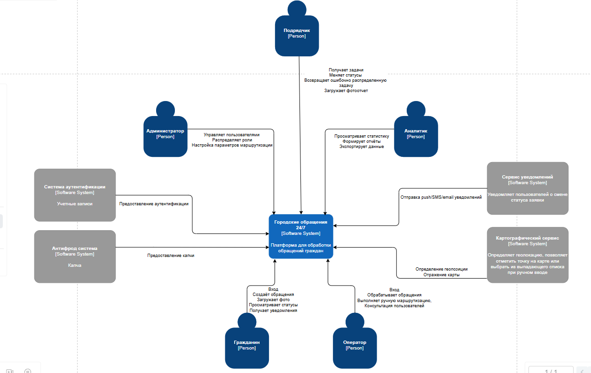

# Контекст и границы SoI системы «Городские обращения 24/7»

---

## Содержание

1. [Тема](#1-Тема)
2. [Цель системы](#2-Цель-системы)
3. [Внешние сущности](#3-Внешние-сущности)
    1. [Пользователи и их взаимодействие с системой](#31-Пользователи-и-их-взаимодействие-с-системой)
    2. [Внешние интеграции и их обоснование](#32-Внешние-интеграции-и-их-обоснование)
4. [Границы системы](#4-границы-системы)
    1. [В зоне ответственности системы (внутри границ)](#41-В-зоне-ответственности-системы-внутри-границ)
    2. [Вне зоны ответственности системы (вне границ)](#42-Вне-зоны-ответственности-системы-вне-границ)

---

## 1. Тема

**Система обработки обращений граждан «Городские обращения 24/7»**

---

## 2. Цель системы

Цель Системы — обеспечить прозрачный, быстрый и контролируемый процесс приёма, маршрутизации и исполнения обращений граждан по проблемам городской инфраструктуры:

- предоставить гражданам удобный инструмент подачи обращений с фото и геолокацией, отслеживания статуса и получения уведомлений;
- автоматизировать классификацию проблем и назначение ответственных подрядчиков для сокращения времени реакции;
- обеспечить операторов и администраторов средствами ручной обработки, контроля качества и аудита;
- дать аналитикам возможность оценивать эффективность подрядчиков, выявлять проблемные зоны и готовить отчёты для управленческих решений;
- гарантировать сохранность данных и устойчивость сервиса даже при отказах внешних зависимостей.

---

## 3. Внешние сущности

Для демонстрации потоков взаимодействия между проектируемой системой и внешними сущностями используется контекстный уровень диаграммы C4.

### 3.1 Пользователи и их взаимодействие с системой

| Пользователь  | Основные действия                                                                                                                                                                                                               |
| ------------- | ------------------------------------------------------------------------------------------------------------------------------------------------------------------------------------------------------------------------------- |
| Гражданин     | Регистрация / авторизация (через Госуслуги или по телефону); создание обращения с фото, описанием и геолокацией; просмотр статуса и истории обращений; получение уведомлений о смене статуса; связь с оператором (комментарии). |
| Оператор      | Просмотр очереди обращений, фильтрация, поиск; ручная классификация и корректировка категории; переназначение подрядчика; отклонение ошибочных / спам-обращений с указанием причины; консультирование граждан по обращениям.    |
| Подрядчик     | Просмотр назначенных задач (только своих); изменение статуса: «Принято» → «В работе» → «Выполнено»; загрузка фотоотчётов и комментариев; возврат обращения оператору с указанием причины.                                       |
| Аналитик      | Доступ к историческим данным и статистике; построение отчётов с фильтрацией по району, категории, подрядчику, статусу; визуализация проблем на карте; оценка эффективности подрядчиков; экспорт данных.                         |
| Администратор | Управление пользователями и ролями (RBAC); настройка правил маршрутизации, категорий обращений, зон ответственности подрядчиков; конфигурация уведомлений; просмотр аудит-логов; мониторинг и восстановление после сбоев.       |

### 3.2 Внешние интеграции и их обоснование

| Интеграция                                                                                   | Назначение и обоснование                                                                                                                                                                                                                                                                                                                                                                   |
| -------------------------------------------------------------------------------------------- | ------------------------------------------------------------------------------------------------------------------------------------------------------------------------------------------------------------------------------------------------------------------------------------------------------------------------------------------------------------------------------------------ |
| Картографический сервис (Яндекс.Карты / 2ГИС)                                                | Автоматическое определение геолокации пользователя и обратное геокодирование адреса. Отображение проблемных зон на карте для аналитиков. Использование готового картографического API позволяет не разрабатывать собственную систему координат и карт, сокращая затраты. Падение сервиса не приводит к остановке приёма обращений — предусмотрен fallback с ручным выбором точки. |
| Шлюзы уведомлений (Push — через Firebase / APNS, SMS — через агрегатора, Email — через SMTP) | Своевременное информирование граждан о смене статуса и подрядчиков о новых задачах. Использование внешних шлюзов избавляет от необходимости строить собственную инфраструктуру доставки сообщений (дорого и сложно). Асинхронная очередь и повторные попытки компенсируют временную недоступность шлюзов.                                                                            |
| Система аутентификации (Госуслуги / mail/телефон)                                            | Граждане могут авторизоваться через подтверждённую учётную запись Госуслуг — это повышает доверие и снижает число анонимных спам-обращений. Для операторов и подрядчиков возможна интеграция с корпоративным Active Directory. Система не хранит пароли, получая только подтверждённые атрибуты (ФИО, email, телефон).                                                               |

---

## 4. Границы системы

### 4.1 В зоне ответственности системы (внутри границ)

| Компонент / контейнер                          | Что обеспечивает                                                                                                                         |
| ---------------------------------------------- | ---------------------------------------------------------------------------------------------------------------------------------------- |
| Веб-приложение (гражданин)                     | Форма создания обращений, просмотр статуса и истории, загрузка фото, отображение карты (через интеграцию).                               |
| Мобильное приложение (гражданин)               | Аналогичные функции + офлайн-сохранение черновиков, GPS-координаты, push-уведомления.                                                    |
| Приложение подрядчика                          | Список задач, изменение статусов, загрузка фотоотчётов, локальное кэширование, офлайн-режим с очередью синхронизации.                    |
| Интерфейс оператора                            | Таблица обращений с фильтрацией и поиском, карточка для редактирования, ручная маршрутизация, объединение дубликатов, история изменений. |
| Административная панель + Аналитический модуль | Управление пользователями и ролями, настройка правил маршрутизации, категорий и подрядчиков; дашборды, отчёты, экспорт.                  |
| API-шлюз (Gateway)                             | Единая точка входа, аутентификация (через JWT), rate limiting, маршрутизация запросов к микросервисам.                                   |
| Сервис обращений                               | Приём, валидация, сохранение в БД, присвоение ID и начального статуса, генерация событий.                                                |
| Сервис маршрутизации                           | Автоматическая классификация (ML / правила), выбор подрядчика по зоне ответственности, fallback-очередь оператора.                       |
| Сервис статусов (Workflow)                     | Конечный автомат переходов, контроль допустимых изменений ролями, фиксация времени.                                                      |
| Сервис уведомлений                             | Формирование и отправка уведомлений через внешние шлюзы, очередь, повторные попытки.                                                     |
| Сервис фото и файлов                           | Загрузка, проверка размера и формата, вычисление контрольных сумм, интеграция с S3.                                                      |
| Сервис геоданных                               | Абстракция над картографическим API, кэширование, fallback на ручной ввод.                                                               |
| Сервис дубликатов                              | Проверка похожих обращений (по гео, категории, тексту), предупреждение пользователя.                                                     |
| Сервис аудита и логирования                    | Неизменяемый аудит всех действий (кто, что, когда, IP, ID обращения).                                                                    |
| Сервис аналитики и отчётов                     | Агрегация данных, формирование витрин, онлайн- и асинхронные отчёты, кэширование.                                                        |
| Брокер сообщений                               | Асинхронный обмен событиями между сервисами (Kafka / RabbitMQ).                                                                          |
| База данных (Ticket DB)                        | Реляционное хранение обращений, статусов, назначений, истории.                                                                           |
| Кэш (Redis)                                    | Кэширование справочников, сессий, результатов геокодирования, очередей фоновых задач.                                                    |

### 4.2 Вне зоны ответственности системы (вне границ)

| Сущность                                             | Почему вне границ                                                                                                                                     |
| ---------------------------------------------------- | ----------------------------------------------------------------------------------------------------------------------------------------------------- |
| Картографический API                                 | Готовый внешний сервис. Система только адаптируется к нему через сервис геоданных. Разработка собственных карт экономически нецелесообразна.          |
| Шлюзы уведомлений (Push, SMS, Email)                 | Сторонние агрегаторы. Система формирует запросы, но не реализует физическую доставку сообщений.                                                       |
| Система аутентификации (Госуслуги, SSO, AD)          | Система не хранит пароли и не проводит первичную аутентификацию — только проверяет токены и получает атрибуты.                                        |
| Резервное копирование на уровне физических носителей | Система может инициировать резервное копирование БД, но не отвечает за ленточные библиотеки или облачные бэкапы (это задача DevOps / инфраструктуры). |
| Антифрод-система (CAPTCHA)                           | При необходимости используется внешний сервис (например, reCAPTCHA). Система только интегрирует его вызов.                                            |
